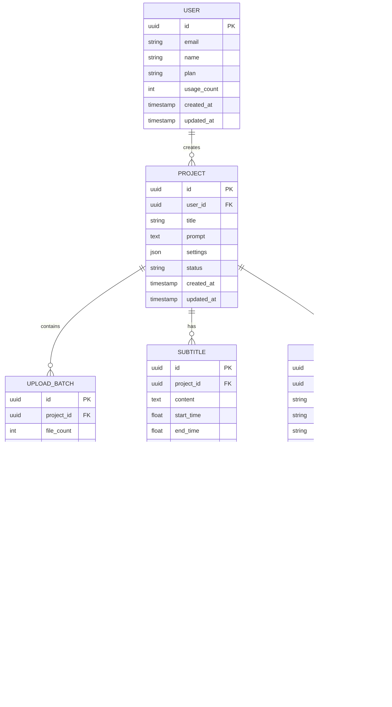

# 照片轉影片Web應用程式技術架構文檔

## 1. 架構設計


## 2. 技術描述

* **前端**: React\@18 + TypeScript + Tailwind CSS + Vite

* **後端**: Supabase (認證、資料庫、檔案儲存)

* **AI服務**: 外部AI影片生成API

* **檔案處理**: 瀏覽器端檔案處理 + 雲端儲存

## 3. 路由定義

| 路由          | 用途                 |
| ----------- | ------------------ |
| /           | 首頁，展示產品介紹和開始使用按鈕   |
| /upload     | 照片上傳頁面，支援拖放和批量上傳功能 |
| /prompt     | 提示詞輸入頁面，AI生成參數設定   |
| /subtitle   | 字幕設定頁面，字幕樣式和時間軸編輯  |
| /processing | 處理進度頁面，顯示影片生成進度    |
| /preview    | 結果預覽頁面，影片播放和下載功能   |
| /login      | 用戶登入頁面             |
| /register   | 用戶註冊頁面             |
| /profile    | 用戶個人資料和歷史記錄        |

## 4. API定義

### 4.1 核心API

**檔案上傳相關**

```
POST /api/upload
```

請求參數:

| 參數名稱   | 參數類型    | 是否必需  | 描述         |
| ------ | ------- | ----- | ---------- |
| files  | File\[] | true  | 上傳的照片檔案陣列  |
| userId | string  | false | 用戶ID（註冊用戶） |

回應參數:

| 參數名稱     | 參數類型      | 描述         |
| -------- | --------- | ---------- |
| success  | boolean   | 上傳是否成功     |
| fileUrls | string\[] | 上傳檔案的URL陣列 |
| uploadId | string    | 上傳批次ID     |

**影片生成相關**

```
POST /api/generate-video
```

請求參數:

| 參數名稱      | 參數類型              | 是否必需  | 描述      |
| --------- | ----------------- | ----- | ------- |
| imageUrls | string\[]         | true  | 照片URL陣列 |
| prompt    | string            | true  | AI生成提示詞 |
| subtitles | SubtitleConfig\[] | false | 字幕配置陣列  |
| quality   | string            | false | 影片品質設定  |

回應參數:

| 參數名稱          | 參數類型   | 描述        |
| ------------- | ------ | --------- |
| jobId         | string | 處理任務ID    |
| estimatedTime | number | 預估處理時間（秒） |

**處理狀態查詢**

```
GET /api/job-status/{jobId}
```

回應參數:

| 參數名稱          | 參數類型   | 描述                                        |
| ------------- | ------ | ----------------------------------------- |
| status        | string | 處理狀態（pending/processing/completed/failed） |
| progress      | number | 處理進度（0-100）                               |
| videoUrl      | string | 完成後的影片URL                                 |
| remainingTime | number | 預估剩餘時間（秒）                                 |

### 4.2 TypeScript類型定義

```typescript
interface SubtitleConfig {
  text: string;
  startTime: number;
  endTime: number;
  position: 'top' | 'center' | 'bottom';
  style: {
    fontSize: number;
    color: string;
    backgroundColor?: string;
    fontFamily: string;
  };
  animation: 'fade' | 'slide' | 'typewriter' | 'scale';
}

interface VideoGenerationRequest {
  imageUrls: string[];
  prompt: string;
  subtitles?: SubtitleConfig[];
  quality: 'HD' | 'FHD' | '4K';
  format: 'MP4' | 'MOV' | 'GIF';
}

interface ProcessingJob {
  id: string;
  status: 'pending' | 'processing' | 'completed' | 'failed';
  progress: number;
  createdAt: Date;
  completedAt?: Date;
  videoUrl?: string;
  errorMessage?: string;
}
```

## 5. 資料模型

### 5.1 資料模型定義



### 5.2 資料定義語言

**用戶表 (users)**

```sql
-- 創建用戶表
CREATE TABLE users (
    id UUID PRIMARY KEY DEFAULT gen_random_uuid(),
    email VARCHAR(255) UNIQUE NOT NULL,
    name VARCHAR(100) NOT NULL,
    plan VARCHAR(20) DEFAULT 'free' CHECK (plan IN ('free', 'premium', 'enterprise')),
    usage_count INTEGER DEFAULT 0,
    created_at TIMESTAMP WITH TIME ZONE DEFAULT NOW(),
    updated_at TIMESTAMP WITH TIME ZONE DEFAULT NOW()
);

-- 創建索引
CREATE INDEX idx_users_email ON users(email);
CREATE INDEX idx_users_plan ON users(plan);
```

**專案表 (projects)**

```sql
-- 創建專案表
CREATE TABLE projects (
    id UUID PRIMARY KEY DEFAULT gen_random_uuid(),
    user_id UUID REFERENCES users(id) ON DELETE CASCADE,
    title VARCHAR(200) NOT NULL,
    prompt TEXT,
    settings JSONB DEFAULT '{}',
    status VARCHAR(20) DEFAULT 'draft' CHECK (status IN ('draft', 'processing', 'completed', 'failed')),
    created_at TIMESTAMP WITH TIME ZONE DEFAULT NOW(),
    updated_at TIMESTAMP WITH TIME ZONE DEFAULT NOW()
);

-- 創建索引
CREATE INDEX idx_projects_user_id ON projects(user_id);
CREATE INDEX idx_projects_status ON projects(status);
CREATE INDEX idx_projects_created_at ON projects(created_at DESC);
```

**上傳批次表 (upload\_batches)**

```sql
-- 創建上傳批次表
CREATE TABLE upload_batches (
    id UUID PRIMARY KEY DEFAULT gen_random_uuid(),
    project_id UUID REFERENCES projects(id) ON DELETE CASCADE,
    file_count INTEGER DEFAULT 0,
    status VARCHAR(20) DEFAULT 'uploading' CHECK (status IN ('uploading', 'completed', 'failed')),
    created_at TIMESTAMP WITH TIME ZONE DEFAULT NOW()
);

-- 創建索引
CREATE INDEX idx_upload_batches_project_id ON upload_batches(project_id);
```

**圖片檔案表 (image\_files)**

```sql
-- 創建圖片檔案表
CREATE TABLE image_files (
    id UUID PRIMARY KEY DEFAULT gen_random_uuid(),
    batch_id UUID REFERENCES upload_batches(id) ON DELETE CASCADE,
    filename VARCHAR(255) NOT NULL,
    file_url TEXT NOT NULL,
    file_size INTEGER NOT NULL,
    mime_type VARCHAR(50) NOT NULL,
    width INTEGER,
    height INTEGER,
    uploaded_at TIMESTAMP WITH TIME ZONE DEFAULT NOW()
);

-- 創建索引
CREATE INDEX idx_image_files_batch_id ON image_files(batch_id);
```

**字幕表 (subtitles)**

```sql
-- 創建字幕表
CREATE TABLE subtitles (
    id UUID PRIMARY KEY DEFAULT gen_random_uuid(),
    project_id UUID REFERENCES projects(id) ON DELETE CASCADE,
    content TEXT NOT NULL,
    start_time FLOAT NOT NULL,
    end_time FLOAT NOT NULL,
    position VARCHAR(20) DEFAULT 'bottom' CHECK (position IN ('top', 'center', 'bottom')),
    style_config JSONB DEFAULT '{}',
    animation_type VARCHAR(20) DEFAULT 'fade' CHECK (animation_type IN ('fade', 'slide', 'typewriter', 'scale')),
    order_index INTEGER DEFAULT 0
);

-- 創建索引
CREATE INDEX idx_subtitles_project_id ON subtitles(project_id);
CREATE INDEX idx_subtitles_order ON subtitles(project_id, order_index);
```

**影片輸出表 (video\_outputs)**

```sql
-- 創建影片輸出表
CREATE TABLE video_outputs (
    id UUID PRIMARY KEY DEFAULT gen_random_uuid(),
    project_id UUID REFERENCES projects(id) ON DELETE CASCADE,
    video_url TEXT NOT NULL,
    format VARCHAR(10) DEFAULT 'MP4' CHECK (format IN ('MP4', 'MOV', 'GIF')),
    quality VARCHAR(10) DEFAULT 'HD' CHECK (quality IN ('HD', 'FHD', '4K')),
    file_size BIGINT,
    duration FLOAT,
    status VARCHAR(20) DEFAULT 'generating' CHECK (status IN ('generating', 'completed', 'failed')),
    generated_at TIMESTAMP WITH TIME ZONE DEFAULT NOW()
);

-- 創建索引
CREATE INDEX idx_video_outputs_project_id ON video_outputs(project_id);
```

**權限設定**

```sql
-- 為匿名用戶授予基本讀取權限
GRANT SELECT ON projects TO anon;
GRANT SELECT ON image_files TO anon;

-- 為認證用戶授予完整權限
GRANT ALL PRIVILEGES ON users TO authenticated;
GRANT ALL PRIVILEGES ON projects TO authenticated;
GRANT ALL PRIVILEGES ON upload_batches TO authenticated;
GRANT ALL PRIVILEGES ON image_files TO authenticated;
GRANT ALL PRIVILEGES ON subtitles TO authenticated;
GRANT ALL PRIVILEGES ON video_outputs TO authenticated;
```

