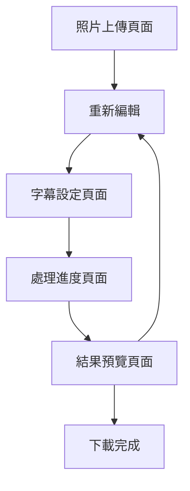

# 照片轉影片Web應用程式產品需求文檔

## 1. 產品概述

本產品是一個現代簡約的Web應用程式，專門用於將靜態照片轉換為動態影片並添加自訂字幕。用戶可以透過直觀的介面上傳照片、輸入AI提示詞、設定字幕樣式，最終生成高品質的影片內容，適用於社交媒體分享、行銷宣傳和個人創作等場景。

產品目標是提供簡單易用的影片創作工具，讓沒有專業影片編輯經驗的用戶也能快速製作出專業水準的影片內容。

## 2. 核心功能

### 2.1 用戶角色

| 角色   | 註冊方式   | 核心權限             |
| ---- | ------ | ---------------- |
| 訪客用戶 | 無需註冊   | 可使用基本功能，單次處理限制   |
| 註冊用戶 | 電子郵件註冊 | 完整功能使用權限，雲端儲存    |
| 高級用戶 | 付費升級   | 無限制使用，高品質輸出，批量處理 |

### 2.2 功能模組

本應用程式包含以下五個主要頁面：

1. **照片上傳頁面**：拖放上傳區域、批量選擇、縮圖預覽
2. **提示詞輸入頁面**：AI提示詞編輯器、字數統計、草稿保存
3. **字幕設定頁面**：字幕編輯器、樣式設定、時間軸控制
4. **處理進度頁面**：視覺化進度條、狀態提示、預估時間
5. **結果預覽頁面**：影片播放器、品質選擇、下載選項

### 2.3 頁面詳情

| 頁面名稱    | 模組名稱  | 功能描述                          |
| ------- | ----- | ----------------------------- |
| 照片上傳頁面  | 拖放上傳區 | 支援拖放和點擊上傳，顯示上傳進度，檔案格式驗證       |
| 照片上傳頁面  | 批量管理  | 多張照片選擇，縮圖預覽，排序調整，刪除功能         |
| 照片上傳頁面  | 檔案資訊  | 顯示檔案名稱、大小、解析度，支援格式提示          |
| 提示詞輸入頁面 | 文字編輯器 | 多行文字輸入，字數統計（50-500字），即時字數提示   |
| 提示詞輸入頁面 | 範例提示  | 預設範例按鈕，分類標籤（動感、溫馨、商業、藝術）      |
| 提示詞輸入頁面 | 草稿功能  | 自動保存草稿，歷史記錄，快速載入              |
| 字幕設定頁面  | 文字設定  | 字幕內容輸入，字體選擇，大小調整（12-48px）     |
| 字幕設定頁面  | 樣式設定  | 顏色選擇器，背景設定，透明度調整              |
| 字幕設定頁面  | 位置控制  | 九宮格位置選擇，精確座標調整，預覽功能           |
| 字幕設定頁面  | 動畫效果  | 淡入淡出、滑入滑出、打字效果、縮放效果           |
| 字幕設定頁面  | 時間軸編輯 | 字幕顯示時間設定，多段字幕管理，時間軸拖拽         |
| 處理進度頁面  | 進度顯示  | 圓形進度條，百分比顯示，處理階段說明            |
| 處理進度頁面  | 狀態提示  | 當前處理步驟，預估剩餘時間，處理提示            |
| 處理進度頁面  | 背景處理  | 允許用戶離開頁面，處理完成通知，錯誤處理          |
| 結果預覽頁面  | 影片播放器 | 播放/暫停控制，音量調整，全螢幕模式，進度條        |
| 結果預覽頁面  | 品質選擇  | 多種解析度選項（720p、1080p、4K），檔案大小預估 |
| 結果預覽頁面  | 下載功能  | 多格式下載（MP4、MOV、GIF），雲端儲存，分享連結  |
| 結果預覽頁面  | 編輯選項  | 重新編輯按鈕，複製專案，儲存範本              |

## 3. 核心流程

### 主要用戶操作流程

用戶首先進入照片上傳頁面，透過拖放或點擊方式上傳一張或多張照片。上傳完成後進入提示詞輸入頁面，用戶可以輸入AI生成影片的描述文字，系統提供範例和建議。接下來進入字幕設定頁面，用戶可以添加字幕文字並調整樣式、位置和動畫效果。設定完成後系統開始處理，用戶在處理進度頁面可以看到即時進度和預估時間。最後在結果預覽頁面，用戶可以預覽生成的影片並選擇下載格式。

## 4. 用戶介面設計

### 4.1 設計風格

* **主色調**：藍色系（#2563EB主藍、#3B82F6輔助藍）

* **輔助色**：純白色（#FFFFFF）、淺灰色（#F8FAFC）

* **強調色**：綠色（#10B981成功）、橙色（#F59E0B警告）、紅色（#EF4444錯誤）

* **按鈕風格**：圓角設計（8px圓角），柔和陰影效果

* **字體**：系統字體優先（-apple-system, BlinkMacSystemFont, 'Segoe UI'）

* **字體大小**：標題24px、副標題18px、正文16px、說明文字14px

* **佈局風格**：卡片式設計，充足的留白空間

* **圖標風格**：線性圖標，統一的視覺語言

### 4.2 頁面設計概覽

| 頁面名稱    | 模組名稱 | UI元素                          |
| ------- | ---- | ----------------------------- |
| 照片上傳頁面  | 拖放區域 | 虛線邊框卡片，雲朵上傳圖標，藍色主題，hover效果變深藍 |
| 照片上傳頁面  | 縮圖預覽 | 網格佈局，圓角縮圖，刪除按鈕，拖拽排序指示         |
| 提示詞輸入頁面 | 編輯器  | 大型文字區域，圓角邊框，字數統計右下角，藍色焦點邊框    |
| 提示詞輸入頁面 | 範例標籤 | 圓角標籤按鈕，淺藍背景，點擊變深藍，平滑過渡動畫      |
| 字幕設定頁面  | 樣式面板 | 分組卡片設計，滑桿控制項，顏色選擇器，即時預覽區域     |
| 字幕設定頁面  | 時間軸  | 水平時間軸，拖拽控制點，藍色進度條，時間刻度標記      |
| 處理進度頁面  | 進度圓環 | 藍色圓形進度條，中央百分比數字，旋轉動畫效果        |
| 處理進度頁面  | 狀態提示 | 步驟指示器，當前步驟高亮，完成步驟綠色勾選         |
| 結果預覽頁面  | 播放器  | 黑色背景播放器，白色控制按鈕，藍色進度條          |
| 結果預覽頁面  | 下載選項 | 格式選擇卡片，品質標籤，檔案大小提示，主要下載按鈕     |

### 4.3 響應式設計

本應用程式採用移動優先的響應式設計策略：

* **桌面版（≥1024px）**：三欄式佈局，側邊欄導航，充分利用螢幕空間

* **平板版（768px-1023px）**：兩欄式佈局，摺疊式導航，適中的元素間距

* **手機版（<768px）**：單欄式佈局，底部導航，大型觸控按鈕，垂直堆疊元素

* **觸控優化**：按鈕最小44px高度，適當的觸控間距，滑動手勢支援

